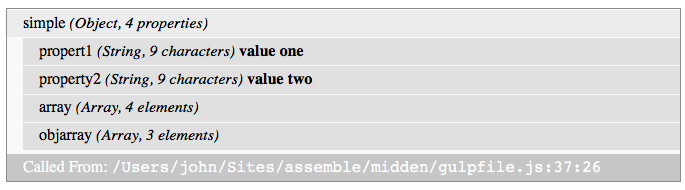

**Formally know as handlebars-midden**


# assemble-midden
Assemble Helper to create pretty/interactive data dumps using [midden](https://github.com/criticalmash/midden).

See the [midden docs](https://github.com/criticalmash/midden#readme) for a further explanation.

## Install
```npm install assemble-midden --save```

## Using with [Assemble.js](https://github.com/assemble/assemble)

Require assemble-midden into your `assemblefile.js` and register it as a helper. 

```js
var assemble = require('assemble');
var midden = require('assemble-midden');

var app = assemble();

// register midden as a helper
app.helper('midden', midden(true));
```
Midden has one config variable: isActive. This allows you to deactivate it when generating pages for a production environment. When inactive, it just returns an empty string. It might be used like so...

```js
/* assuming var environment was set earlier */
app.helper('midden', midden(environment==='development'));
```

For midden to work, you also need to include it's styles and client-side code. You can find those in `node_modules/midden/dist/[styles, js]`.

Here's how you *might* add them to your `css` and `script` tasks.

### Stylesheets
There are three stylesheets available: `midden.scss`, `midden.css` and `midden.min.css`. Here's how you might add `midden.scss` to a SASS task.

```js
/* using sass and autoprefixer gulp plugins */
var sass = require('gulp-sass');
var autoprefixer = require('gulp-autoprefixer');

/* create an array of paths to outside stylesheets */
var styleIncludes = [
  'node_modules/midden/dist/styles/'
];
app.task('css', function () {
  return app.src('src/scss/app.scss')
    .pipe(sass({includePaths: styleIncludes})
    .pipe(autoprefixer())
    .pipe(app.dest('build/css'));
});
```
Then in your `app.scss` file...

```scss
/* Need to include extension so that SASS doesn't include the wrong file */
@import "midden.scss";
```

### Client-Side JavaScript
If you're using browserify to process your Javascript, just require it in your main JS file.

```js
require('midden/dist/js/midden-client.js');
```
On page load, it will look for midden elements to attach event handlers to.

### Within your Handlebars Files
Wherever you need to inspect a context value just pass it to the helper.

```Handlebars
{{midden "view.data"}}
```
Load that page from your destination directory and you should see something like this...


## Tips for Use
- When passed large objects, midden can generate large amounts of HTML. If you're interested in just a small part of that object then specify it in your call to midden.
- The midden client-side code uses methods not supported by IE versions 9 and earlier (which shouldn't be a problem in a development only environment). Just in case you're using an older IE you might have to install a shim like [classList](https://github.com/eligrey/classList.js/blob/master/classList.js).

## Customizing Styles
The ```dist/styles/midden.scss``` file uses over-writable default values for colors, etc. See the file for a list of values. 

## Release History
### v0.1.0
Beta release

### v0.4.1
Fixed issue caused by newer Versions of Assemble.js storing some template properties as buffer.

## Contributing and Issues
Feel free to submit issues or pull requests for [assemble-midden](https://github.com/criticalmash/assemble-midden/issues) or [midden](https://github.com/criticalmash/midden/issues). Questions on use can also be submitted to the issue queue.

There's a suite of unit tests. ```mocha test/*-spec.js```

Midden also has a gulp file for generating client-side assets and integration testing. ``gulp default`` will spin up a server on port 8000. There, you can demo midden.

## License
© 2016 John O'Donnell (Critical Mash Inc.) Released under the [MIT license](LICENSE).